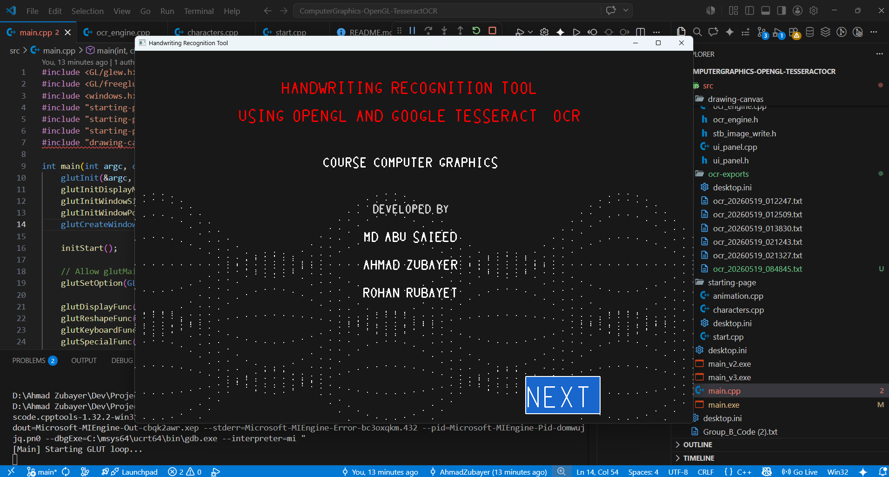
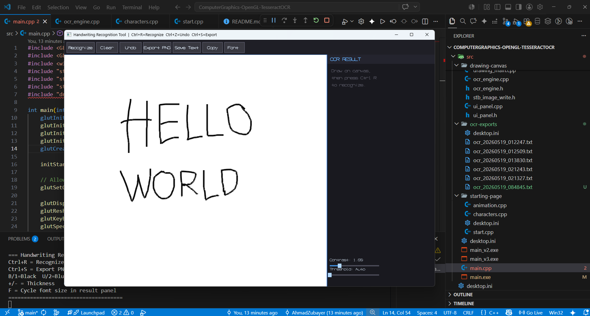
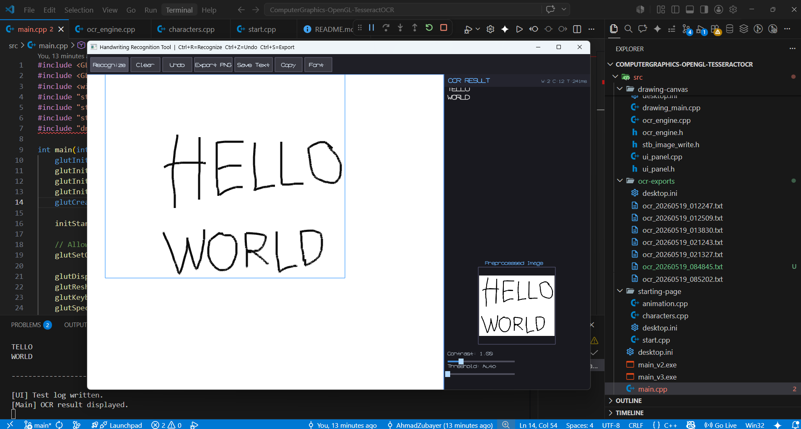
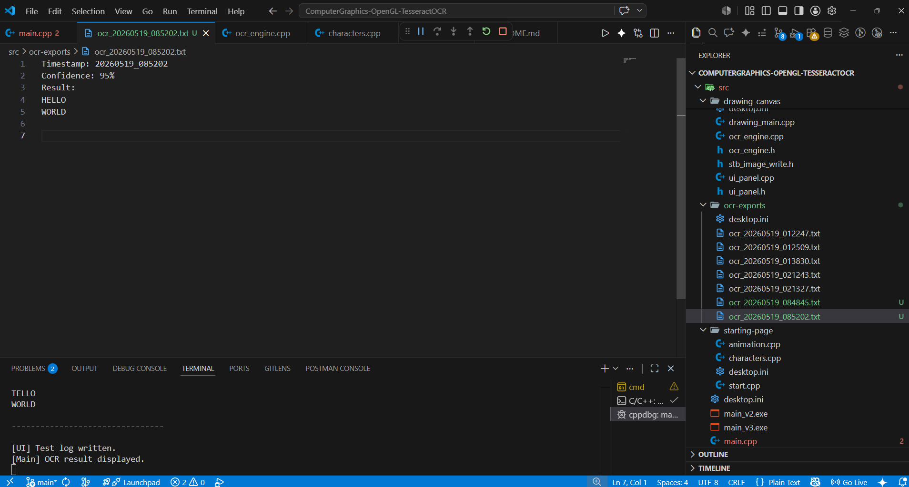

# Handwriting Recognition Tool

An interactive and intelligent handwriting recognition application that bridges the gap between digital sketching and automated text conversion. This tool provides a seamless experience, starting from a visually engaging welcome page to a powerful drawing canvas equipped with real-time OCR capabilities.

This project was build as the final project of the Computer Graphics course during the Spring 2025-2026 semester, supervised by Faculty, Dipto Justin Gomes, Department of Computer Science, FST, at the American International University - Bangladesh (AIUB).

## Group Members
- 👤 @AhmadZubayer
- 👤 @SAIEED12
- 👤 @THE-ROYET

## Tech Stack

The project utilizes a robust set of libraries and frameworks to handle high-performance graphics and complex image processing:

*   **OpenGL**: The core rendering engine used for both 2D character construction and 3D-like animated environments.
*   **OpenCV**: Employed for advanced image preprocessing, including noise reduction, thresholding, and skew correction to optimize recognition accuracy.
*   **Tesseract OCR**: A powerful engine that handles the conversion of handwritten strokes into digital text.
*   **FreeGLUT**: Manages the windowing and interaction for the project's starting/welcome page.
*   **GLFW**: Used for the main drawing canvas to provide modern windowing features and flexible input handling.
*   **GLEW**: Ensures compatibility with modern OpenGL extensions across different hardware.
*   **stb_image_write**: A lightweight library used for exporting the drawing canvas as high-resolution PNG images.
*   **C++**: The primary programming language, ensuring speed and efficient memory management.

## Project Overview

### Sequential Snapshots

Below are the primary windows and states of the application:

1.  **Welcome Page**
    
    *The entry point of the application featuring a dynamic, animated background created using mathematical wave functions and manually constructed alphanumeric characters.*

2.  **Drawing Canvas**
    
    *A clean, interactive workspace where users can draw strokes using a mouse or stylus. Features include grid toggling, undo functionality, and zooming.*

3.  **Recognition Process**
    
    *Upon triggering recognition, the tool captures the handwriting, applies a bounding box, and processes the image through the OCR engine.*

4.  **UI & Result Panel**
    
    *The final stage where the recognized text is displayed in a dedicated UI panel alongside a preview of the preprocessed image.*

### Transformation and Animation

The project showcases several computer graphics concepts through interactive transformations:

*   **Animated Environment**
    
    *The background utilizes Sine and Cosine functions to animate a grid of points, creating a fluid wave effect.*

*   **Scaling Operations**
     
    *Users can scale their drawings up or down using linear transformation matrices applied to the stroke coordinates.*

*   **Translation (Movement)**
     
    *The entire drawing can be moved across the canvas (Up, Down, Left, Right) using translation matrices.*

## Folder Structure

```text
ComputerGraphics-OpenGL-TesseractOCR/
├── project-screenshots/     # Visual documentation of the project
└── src/
    ├── drawing-canvas/      # Main tool logic (Canvas, UI, OCR Engine)
    ├── starting-page/       # Welcome screen, animations, and character geometry
    ├── canvas-exports/      # Automatically saved PNG images of drawings
    ├── ocr-exports/         # Saved text results from recognition
    └── main.cpp             # Project entry point and workflow manager
```

## Workflow and Shortcuts

### 1. Application Initialization
- **File:** `src/main.cpp`
- **Process:** Window created and GLUT environment initialized. Start page invoked as the first module.

### 2. Welcome Page Execution
- **Files:** `src/starting-page/start.cpp`, `src/starting-page/animation.cpp`, `src/starting-page/characters.cpp`
- **Shortcuts:**
    - `NEXT Button`: Clicked to exit start page and launch drawing tool.
    - `Ctrl + Right Arrow`: Transitioned to the drawing tool.
    - `'w'`: Animation speed set to 0.02.
    - `'a'`: Animation stopped.
    - `Up Arrow`: Animation speed increased.
    - `Down Arrow`: Animation speed decreased.
    - `'+'`: Zoomed in on the welcome page.
    - `'-'`: Zoomed out on the welcome page.

### 3. Drawing Canvas Operation
- **Files:** `src/drawing-canvas/drawing_main.cpp`, `src/drawing-canvas/canvas.cpp`, `src/drawing-canvas/ui_panel.cpp`
- **Shortcuts:**
    - `Left Mouse Button`: Strokes drawn on the canvas.
    - `Middle Mouse Button`: Canvas panned.
    - `Mouse Scroll`: Canvas zoomed in/out.
    - `Ctrl + R`: Recognition process triggered.
    - `Ctrl + Z`: Last stroke undone.
    - `Ctrl + S`: Canvas exported as PNG.
    - `Ctrl + T`: OCR re-run with current settings.
    - `'1'` or `'b'`: Pen color changed to Black.
    - `'2'` or `'u'`: Pen color changed to Blue.
    - `'3'` or `'r'`: Pen color changed to Red.
    - `'e'`: Eraser mode toggled.
    - `'c'`: Canvas cleared completely.
    - `'g'`: Background grid toggled.
    - `'z'`: Bezier smoothing toggled (ON/OFF).
    - `'f'`: Result panel font size cycled.
    - `'+'` / `'-'`: Pen thickness increased/decreased.
    - `'['` / `']'`: Entire drawing rotated.
    - `Shift + '+'`: Entire drawing scaled up.
    - `Shift + '-'`: Entire drawing scaled down.
    - `Arrow Keys`: Entire drawing translated (moved).
    - `ESC`: Application closed.

### 4. Image Processing and Character Recognition
- **File:** `src/drawing-canvas/ocr_engine.cpp`
- **Process:** Framebuffer captured and cropped to the handwriting bounding box. Tesseract engine utilized to recognize text from the processed image.

### 5. Data Export and Final Output
- **Folders:** `src/canvas-exports`, `src/ocr-exports`
- **Process:** 
    - Processed drawing exported as a PNG file.
    - Recognized text saved as a TXT file.
    - Results displayed in the application's result panel and printed to the terminal.
